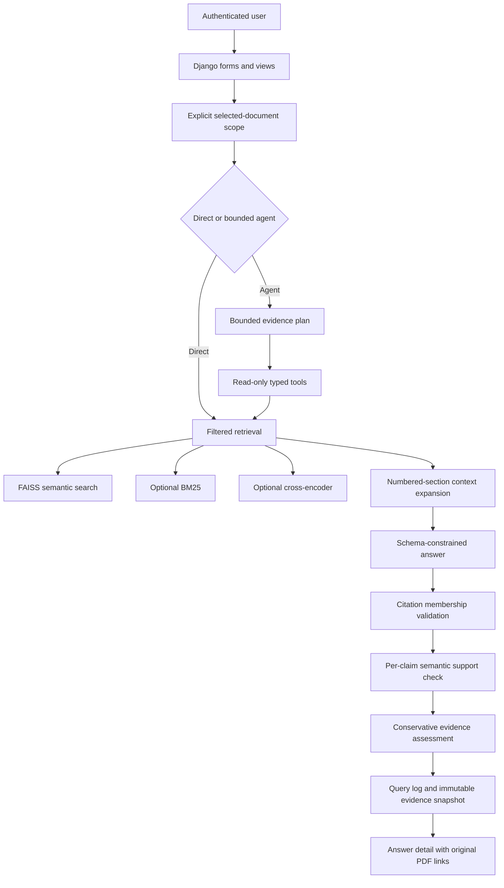

# Compliance Assistant — Complete Project Context and Agent Handoff

**Last reconciled:** 4 October 2026  
**Repository:** `compliance-assiistant`  
**Application type:** Django-based, source-grounded regulatory research and compliance-analysis system  
**Implementation status:** Phases 0–3 are implemented as software workflows; human acceptance, live quality validation, and production deployment remain incomplete.

---

## 1. Purpose of this document

This is the single, comprehensive context document for the project. It is intended to be given to a developer, coding agent, reviewer, operator, or product stakeholder who has no access to the previous conversation.

It explains:

- Why the product exists and the problem it solves.
- What has actually been built.
- How every major workflow behaves.
- The architectural and safety decisions behind the system.
- What data currently exists in the local project.
- How retrieval, generation, citations, evaluation, obligations, and gap analysis interact.
- Which claims are proven by tests and which still need human or live validation.
- Known limitations, risks, and deferred work.
- Recommended next steps and extension opportunities.

This document intentionally does **not** reproduce source code. It describes behavior, contracts, relationships, and operating procedures at enough depth for another agent to work safely and intelligently.

### Source-of-truth order

If information conflicts, use this priority:

1. Current source code and database migrations.
2. Current database and active vector-index manifest.
3. This document.
4. `PROJECT_STATUS.md` and focused documentation under `docs/`.
5. `ANTIGRAVITY_IMPLEMENTATION_PLAN.md`, which is the original intended specification, not proof that a feature passed acceptance.
6. Older walkthroughs or historical evaluation records.

Never interpret a plan, test fixture, draft gold answer, or UI label as evidence that the underlying legal conclusion is correct.

---

## 2. Executive summary

The Compliance Assistant is an auditable Retrieval-Augmented Generation application for working with regulatory PDFs and internal company policies. It is more than a basic “chat with PDF” system.

The product can:

1. Accept and classify readable PDF documents.
2. Break them into traceable paragraph/page-linked passages.
3. Build a locally stored semantic vector index.
4. Require users to choose exactly which documents may be used for a question.
5. Retrieve evidence using semantic, keyword-assisted, or reranked search.
6. Generate structured claims rather than an uncontrolled paragraph.
7. Validate citations against the retrieved evidence.
8. Run a second semantic support check for every claim.
9. Abstain when evidence is missing or validation fails.
10. Preserve full question, answer, evidence, model, prompt, and index metadata for audit.
11. Run a bounded multi-step evidence agent for complex questions.
12. Extract draft regulatory obligations from eligible binding sources.
13. Require human confirmation before obligations become usable.
14. Compare confirmed obligations against an internal company policy.
15. Produce reviewable policy-gap findings and a PDF report.
16. Maintain review queues, analytics, gold-reference review, and evaluation runs.

The project’s defining idea is **controlled evidence flow**. A language model is never treated as the source of truth. Source classification, retrieval scope, citation membership, support judgments, review state, and original-document access remain visible.

---

## 3. Product mission

### Core mission

Turn uploaded regulatory material into a traceable research and compliance-intelligence workflow without presenting automated output as legal advice or compliance certification.

### Primary users

- Compliance analysts researching regulations and reports.
- Legal or policy reviewers verifying source-backed answers.
- Internal governance teams reviewing obligations and policy coverage.
- Administrators maintaining the document corpus and evaluation process.
- Developers or researchers evaluating RAG behavior.

### Main user outcomes

- Ask questions using one or several explicitly selected documents.
- Understand exactly which passages supported each claim.
- See when the system lacks sufficient evidence.
- Distinguish binding sources from drafts, reports, consultations, and internal policies.
- Convert valid binding provisions into human-reviewed obligations.
- Compare those obligations with a company policy and review potential gaps.
- Inspect historical evidence snapshots even after the live corpus changes.

### Non-goals

The system is not:

- A legal-advice engine.
- A replacement for source review.
- A compliance certification tool.
- A general unrestricted autonomous agent.
- A web crawler or regulatory-monitoring service at present.
- A multi-tenant document platform.
- A production-ready hosted service yet.
- A guarantee that a missing retrieved passage means a requirement does not exist.

---

## 4. What makes the project distinctive

Many document-Q&A systems end after returning a fluent answer and a few similarity matches. This project adds several layers that matter for compliance use:

### Explicit document scoping

Every question requires selection of one to ten indexed documents. Retrieval, agent tools, final evidence, and citations are constrained to that selection. This prevents an RBI question from silently drawing evidence from an unrelated SEBI or shadow-banking document.

### Source authority awareness

Documents carry type, regulator, source category, status, dates, and version metadata. A draft consultation or research report is visibly different from an in-force binding regulation.

### Structured, claim-level answers

The language model must return schema-constrained claims with explicit chunk identifiers. The application builds the human-facing source labels and links from trusted database records.

### Two-stage evidence validation

The application first verifies that cited chunk identifiers were actually supplied to the model. It then uses a separate structured support judgment to label each claim as supported, partial, contradicted, unsupported, or unavailable.

### Conservative abstention

The system can refuse to answer when no sufficient passage exists, structured generation fails, citations are invalid, or semantic support is unavailable. Confidence labels are qualitative and deliberately not presented as probabilities.

### Immutable retrieval provenance

Vector indexes are built as immutable generations with manifests, checksums, corpus fingerprints, and an atomic active pointer. The application refuses to query a stale or incompatible index.

### Human-in-the-loop compliance workflow

Extracted obligations remain candidates until a reviewer confirms or edits them. Gap findings preserve the original automated result even when a reviewer overrides it.

### Separate software completion from acceptance

The repository distinguishes “the workflow exists and is tested” from “the model has been validated on reviewed evidence” and “the system is ready for production.” This distinction must be preserved.

---

## 5. Technology stack

### Application and persistence

- Python 3.12 target environment.
- Django 4.2 series.
- SQLite for the current local database.
- Django templates and custom CSS for the server-rendered UI.
- Private local media storage for uploaded PDFs.

### PDF processing

- PyMuPDF for validation, text extraction, page access, and chunk creation.
- ReportLab for downloadable policy-gap reports.
- OCR is not currently implemented.

### Retrieval and machine learning

- Sentence Transformers for local embeddings.
- Default embedding model: `all-MiniLM-L6-v2`.
- Default embedding dimension: 384.
- FAISS CPU index using normalized vectors and inner-product similarity.
- BM25 through `rank-bm25` for lexical retrieval.
- Default reranker: `cross-encoder/ms-marco-MiniLM-L-6-v2`.

### Generation

- OpenAI-compatible Python client pointed at OpenRouter.
- Pydantic v2 schemas for answer, support, plan, obligation, gap, and correctness outputs.
- Native JSON-schema response mode is requested from compatible providers.
- A model fallback sequence ends with the OpenRouter free router.

### Concurrency and integrity

- File locks protect corpus/index changes and per-document extraction.
- Agent operations run in spawned processes so timed-out work can be terminated.
- Index generations use checksums and an atomic `CURRENT` pointer.

---

## 6. Repository map

### Project configuration

- `manage.py` — Django command entry point.
- `compliance_assistant/settings.py` — environment parsing, security, storage, model, retrieval, timeout, and upload configuration.
- `compliance_assistant/urls.py` — project-level routes.
- `compliance_assistant/wsgi.py` and `asgi.py` — deployment entry points.

### Core application

- `qa/models.py` — all persistent application, audit, review, evaluation, obligation, and gap entities.
- `qa/forms.py` — question selection and PDF upload validation.
- `qa/views.py` — question, answer, document, query log, evaluation, gold review, and index-status views.
- `qa/feature_views.py` — obligation, gap, review queue, analytics, trust, and human judge-review views.
- `qa/permissions.py` — application roles and server-side authorization helpers.
- `qa/admin.py` — Django-admin registrations.
- `qa/apps.py` — development-server embedding warmup.

### Domain services

- `qa/services/documents.py` — indexing and deletion coordination.
- `qa/services/evaluation.py` — gold validation, retrieval metrics, answer evaluation, and run summaries.
- `qa/services/obligations.py` — eligibility, extraction, source validation, and review.
- `qa/services/gap_analysis.py` — policy retrieval and coverage judgments.
- `qa/services/reports.py` — gap-report PDF generation.
- `qa/services/analytics.py` — operational summaries.

### RAG package

- `rag/chunker.py` — PDF-to-passage conversion.
- `rag/embedder.py` — cached local embedding model and normalized vectors.
- `rag/vectorstore.py` — immutable FAISS generation lifecycle and validation.
- `rag/lexical.py` — BM25 retrieval.
- `rag/reranker.py` — cross-encoder reranking.
- `rag/retriever.py` — filters, dense search, rank fusion, reranking, and structural context expansion.
- `rag/schemas.py` — strict model-output contracts.
- `rag/prompts.py` — versioned prompt contracts.
- `rag/generator.py` — OpenRouter call boundary, fallback, repair, metadata, and sanitized failures.
- `rag/faithfulness.py` — deterministic citation membership and semantic support judgments.
- `rag/confidence.py` — conservative evidence-band rules.
- `rag/pipeline.py` — complete direct and agent answer orchestration.
- `rag/agent.py` — bounded evidence planning and trace.
- `rag/tools.py` — typed, read-only agent tools.

### Templates and static assets

- `templates/base.html` — shared navigation and page frame.
- `templates/qa/index.html` — dashboard/home.
- `templates/qa/ask.html` — question and document-scope form.
- `templates/qa/answer_detail.html` — claims, evidence, support, confidence, scope, and trace.
- Additional templates cover documents, logs, evaluation, reviews, obligations, gaps, analytics, index status, trust, and authentication.
- `static/css/custom.css` contains the application styling.

### Commands

- `bootstrap_roles` — create or reconcile Viewer, Contributor, and Admin groups.
- `rebuild_vector_index` — build and activate a complete immutable index generation.
- `check_vector_index` — validate index readiness and corpus compatibility.
- `seed_gold_questions` — historical gold-question seeding.
- `prepare_corpus_gold` — create/update current corpus-aligned draft questions without approving them.
- `run_rag_evaluation` — run a reviewed or explicitly provisional evaluation.
- `compare_retrieval` — compare retrieval modes.
- `check_foundation_gate` — verify acceptance prerequisites.
- `extract_obligations` — process an eligible source in bounded batches.

### Tests

- `tests/test_foundation.py` — ingestion, index, generation contracts, evidence, permissions, views, evaluation, and security foundations.
- `tests/test_intelligence.py` — retrieval, agent, obligations, gap analysis, analytics, and governance behavior.

### Documentation

- `README.md` — concise setup and operating guide.
- `PROJECT_STATUS.md` — implementation and acceptance status.
- `FULL_OPERATIONS_WALKTHROUGH.md` — detailed operator journey.
- `RAG_SYSTEM_CODE_WALKTHROUGH.md` — implementation-oriented RAG explanation.
- `ANTIGRAVITY_IMPLEMENTATION_PLAN.md` — original specification and phased target.
- `docs/` — architecture, model, evaluation, governance, demo, checkpoints, gold review, and the generated Word guide.

---

## 7. High-level architecture

The ingestion path is separate:

```mermaid
flowchart LR
    PDF[Uploaded PDF] --> Validate[Signature, size, pages, encryption, readable text]
    Validate --> Classify[Authority, type, status, dates, version metadata]
    Classify --> Chunk[Paragraph and page-linked chunks]
    Chunk --> DB[(Document and Chunk rows)]
    DB --> Embed[Normalized local embeddings]
    Embed --> Generation[New immutable FAISS generation]
    Generation --> Verify[Checksums, IDs, model, dimension, corpus fingerprint]
    Verify --> Activate[Atomic CURRENT pointer]
```

The compliance-analysis path is:

---

## 8. User roles and authorization

Roles are Django Groups created by `bootstrap_roles`. The command sets permissions but does not assign users or grant Django staff status.

### Viewer

- Sign in.
- View the shared document list.
- Ask scoped questions.
- View their own answer history and answer detail pages.
- Open authenticated source PDFs.

### Contributor

Includes Viewer abilities plus:

- Upload documents.
- Index or re-index documents.
- Run obligation extraction.
- Review extracted obligations.
- Run policy-gap analyses.
- View obligation and gap records allowed by the application.

### Admin

Includes Contributor abilities plus:

- Delete documents.
- Manage corpus and index operations.
- View global query logs.
- Review and run evaluation.
- Review gold references.
- View analytics.
- Use the unified review queue.
- Review automated correctness judgments.
- Manage relevant records through authorized application paths.

### Authorization rules

- Authorization is enforced on the server; hiding navigation is not considered security.
- Query history is owner-scoped unless the user has global-log permission.
- Gap reports are similarly owner/global-permission scoped.
- Source PDFs are delivered through authenticated routes rather than public media URLs.
- The corpus is shared across users. There is no organization-level or per-document tenancy.

---

## 9. Document model and classification

Each document represents one uploaded PDF.

### Document types

- Regulatory source.
- Company policy.

### Regulators currently represented

- RBI.
- SEBI.

The data model can be extended, but the current UI choices are limited to these regulators.

### Source categories

- Unclassified.
- Binding regulation.
- Master direction.
- Circular.
- Consultation paper or draft circular.
- Guidance.
- Research or financial-stability report.
- Internal company policy.

### Source status

- In force.
- Amended.
- Repealed.
- Draft/consultation.
- Not applicable.

### Authority invariants

- A regulatory document requires a regulator.
- A company policy must not be presented as an RBI or SEBI publication.
- Company policies must use the internal-policy or unclassified category.
- Only in-force binding regulations, master directions, and circulars can feed obligation extraction.
- Reports, guidance, consultations, and drafts may be queried but cannot be treated as binding obligation sources.

### Additional metadata

- Title and sanitized original filename.
- Original file and SHA-256 digest.
- Source URL.
- Publication and effective dates.
- Version label and version family.
- Printed-page offset.
- Upload user and time.
- PDF page count.
- Index state, chunk count, and sanitized error status.

Version family is important for comparing dated versions of the same rule. It should be a stable shared identifier, while version label identifies a particular edition.

---

## 10. PDF validation and ingestion

### Upload validation

Before saving a PDF, the system checks:

- Maximum byte size, default 25 MB.
- `%PDF-` file signature.
- Supported content type.
- Parser readability.
- Not encrypted/password-protected.
- Page count between 1 and the configured maximum, default 500.
- At least one page contains extractable text.
- File digest is not already present in the corpus.

Image-only or scanned PDFs are rejected because OCR is not enabled.

### Chunking

The chunker:

- Reads page text through PyMuPDF.
- Recognizes common numbered and alphabetic clause markers.
- Retains paragraph identifiers where possible.
- Tracks PDF start/end pages.
- Computes printed page labels using the configured offset.
- Generates a content digest per passage.
- Uses chunker version `2`.
- Applies bounded passage sizing while trying to preserve clause structure.

Tables and unusual legal formatting remain heuristic. Operators must inspect representative chunks after indexing.

### Idempotent re-indexing

When a document is re-indexed:

- Unchanged positional chunks retain their database identifiers.
- Changed chunks are replaced.
- Removed chunks are deleted.
- Gold approvals referencing changed source material are invalidated.
- A complete new vector generation is built.
- Failure marks the document as errored and prevents stale retrieval.

### Document deletion

Deleting a document removes its database record and rebuilds the corpus index. Uploaded bytes are intentionally retained for recovery. There is no automatic retention cleanup.

---

## 11. Vector index design

### Why immutable generations are used

A single mutable index can easily become inconsistent with database chunks. This project builds each index into a new generation directory and activates it only after validation.

Each generation contains:

- A FAISS binary index.
- A JSON mapping from vector positions to chunk database IDs.
- A manifest containing model, dimension, metric, normalized-vector flag, chunker version, vector count, build time, corpus fingerprint, and file checksums.

An atomic `CURRENT` pointer identifies the active generation.

### Query-time validation

Loading the vector store verifies:

- Manifest schema.
- Active generation identity.
- Checksums.
- Embedding model and dimension.
- FAISS metric and normalization assumptions.
- Vector count and ID-mapping count.
- Unique and exact chunk identifiers.
- Complete corpus fingerprint, including source text and relevant metadata.

If any check fails, queries stop with an “index rebuild required” condition. The application is designed to fail closed rather than silently use stale evidence.

### Locking behavior

- Corpus changes and generation activation occur under a cross-process file lock.
- Slow embedding-model initialization is not unnecessarily kept inside the writer lock.
- Windows sharing violations on pointer replacement receive bounded retries.
- The previous generation remains recoverable if a new build fails.

### Transaction boundary limitation

Database changes and filesystem index activation cannot form one atomic transaction. If the database changes and rebuilding fails, the previous index can remain on disk but is rejected as stale by fingerprint validation. A successful rebuild reconciles the state.

---

## 12. Retrieval system

### Required query scope

Users must select one to ten indexed documents before asking a question. The selected identifiers are persisted in retrieval configuration and displayed on the answer page.

Filters are applied before final top-k selection. An irrelevant document with a higher global similarity score cannot displace evidence inside the selected scope.

### Dense semantic retrieval

- The question is embedded with the same Sentence Transformer used for passages.
- Embeddings are normalized.
- FAISS inner product acts as cosine similarity under normalization.
- Results below the configured confidence floor are removed.
- Default final ranked count is five.

Dense scores are similarity signals, not probabilities.

### Hybrid retrieval

- Dense candidates and BM25 lexical candidates are produced independently.
- Reciprocal-rank fusion combines ranks without mixing incomparable raw scores.
- Dense, BM25, and fused scores remain separately visible in evidence metadata.

Hybrid retrieval is useful for exact regulatory terms, acronyms, dates, clause labels, and names that semantic retrieval may underweight.

### Hybrid retrieval with reranking

- The fused candidate set is rescored by a cross-encoder using the question-passage pair.
- The final top passages are chosen by reranker score.
- The reranker score is not a probability.
- Initial reranker loading may add substantial latency.

### Structural context expansion

A recent failure exposed an important RAG weakness: semantic retrieval found a paragraph saying “the following measures shall be adopted,” but the numbered measures lived in adjacent chunks and were absent from the top five.

The retriever now performs bounded structural expansion when a ranked passage introduces a list:

- It recognizes phrases such as “following measures,” “following changes,” or “as follows.”
- It parses numeric paragraph hierarchies.
- It follows descendant clauses within the same document, for example section `5` into `5.1` through `5.7` and their children.
- It stops at the next sibling or unrelated section.
- It never crosses the selected-document boundary.
- It caps total answer context at 20 passages by default.
- It labels ranked hits separately from structural neighbors.
- Retrieval evaluation continues to measure the original ranked top-k rather than counting expanded neighbors as ranked wins.

This fixed the SEBI derivatives query where the source actually listed seven measures, although the question asked for six. The answer prompt now instructs the model to correct a source-conflicting premise rather than invent the requested count.

### Current default

The default retrieval mode remains dense because accepted quality tuning has not been completed. Users can explicitly choose semantic, combined, or combined-plus-ranking search.

---

## 13. Question strategies

### Direct strategy

Use for focused questions that can likely be answered by one retrieval operation.

Flow:

1. Validate user and selected documents.
2. Load and validate an immutable vector-store snapshot.
3. Retrieve within selected documents.
4. Expand structurally connected list context when appropriate.
5. Generate a schema-constrained answer.
6. Validate citations and claim support.
7. Assign a conservative evidence band.
8. Persist the result and display it.

### Automatic strategy

A simple heuristic routes comparison-style questions to the bounded agent. Trigger patterns include comparisons, differences, version changes, “versus,” and compound evidence questions.

This is not a learned router. It is intentionally understandable and bounded.

### Agent strategy

Use for multi-part, comparison, or multi-document evidence gathering.

The agent:

- Receives only the selected document catalog.
- Produces a short operational evidence plan.
- May define up to four subquestions.
- May perform up to six tool calls.
- Executes each call within a process-enforced timeout.
- Has an overall time budget.
- Stores the plan, tools, inputs, evidence IDs, summaries, latency, and errors.
- Synthesizes a final structured answer from gathered evidence.

It does not store or expose hidden chain-of-thought reasoning. The trace is an operational audit record.

### Available agent tools

- Search selected documents.
- Read metadata for selected documents.
- Retrieve known chunk IDs, within scope.
- Compare two distinct selected documents on a topic.

The agent cannot execute code, access the filesystem, browse arbitrary URLs, mutate documents, or escape the approved document list.

### Version-change constraint

Questions about amendments or “what changed” require two dated versions with:

- A shared, non-empty version family.
- A version label.
- An effective or publication date.

If the selected scope does not establish exactly one usable version family, the agent abstains rather than pretending unrelated documents are versions of one rule.

---

## 14. Generation boundary

### Provider

Generation uses an OpenAI-compatible client configured for OpenRouter. The application has separate configurable answer and judge model names, although both may currently resolve to the same model.

### Structured output

Every model-assisted workflow has a strict Pydantic output contract. The provider is asked for native JSON-schema output with required parameter support.

The system allows at most one repair instruction when non-empty output fails schema validation. Empty content is not sent through a futile repair loop.

### Fallback behavior

Model attempts are ordered as:

1. Configured primary model.
2. Any configured fallback models.
3. The OpenRouter free router as the last resort.

The requested and actual model, fallback usage, token counts when supplied, latency, and prompt version are recorded. Reliable cost is left unknown unless trustworthy pricing inputs are configured.

Authentication failures do not trigger repeated model attempts. Provider errors are sanitized so API keys, provider bodies, and source content do not leak into the UI.

### Prompt-injection boundary

Questions, documents, retrieved passages, and earlier model output are serialized as untrusted data. Prompts explicitly instruct models not to obey apparent instructions inside that data.

This is a useful control, not proof of complete prompt-injection resistance. Live adversarial testing remains incomplete.

### Important security note

An OpenRouter API key was previously pasted into the conversation during debugging. It must be considered exposed and rotated. No documentation should ever copy the secret value.

---

## 15. Answer contract

An answer contains:

- `answerable`: whether sufficient evidence exists.
- `reason`: short abstention or qualification text.
- A list of claims.
- A stable claim ID for each claim.
- Claim text.
- Supporting chunk IDs selected only from supplied evidence.

The model does not author trusted document titles, authority labels, pages, or source URLs. The server attaches those fields from database records.

If the question contains an incorrect premise or count, and the supplied evidence clearly conflicts, the answer should explicitly correct the premise using citations. It must not force the evidence into the requested shape.

---

## 16. Citation and support validation

### Deterministic citation membership

For each claim, every cited chunk ID must exist in the context supplied to the model. A citation outside that context is marked unsupported.

### Semantic claim support

A separate structured judge receives each claim with only its cited passages. It classifies support as:

- Supported.
- Partial.
- Contradicted.
- Unsupported.
- Unavailable, when validation cannot complete.

The judge cannot introduce a supporting citation that the answer did not cite. A supported judgment must contain at least one valid supporting citation.

### Metrics

- Faithfulness is the share of claims judged fully supported.
- Citation precision is the share of judged claim citations that support all or part of the cited claim.
- When semantic validation is unavailable, these values remain unavailable rather than becoming zero or a fabricated success.

### Evidence confidence

Current evidence bands are conservative and uncalibrated:

- `insufficient` when the answer abstains.
- `low` when support checking is unavailable or any claim lacks full support.
- `medium` when all claims are supported.
- The system deliberately does not issue `high` before calibration.

The label describes automated evidence conditions, not the probability that a legal conclusion is correct.

---

## 17. Answer presentation and query audit

The answer detail page shows:

- The original question.
- Selected source scope.
- The information-only/not-legal-advice warning.
- Answerability or abstention reason.
- Claim text.
- Per-claim support status and explanation.
- Source title, authority category, status, paragraph, page span, printed pages, and passage text.
- Authenticated links to the original PDF.
- Evidence confidence and human-review requirement.
- Model, prompt, timing, retrieval mode, threshold, index generation, and fingerprint.
- Agent execution trace when agent mode was used.

Each query log stores:

- User and question.
- Rendered answer and structured payload.
- Retrieved IDs and complete evidence snapshot.
- Similarity/support information.
- Citation and faithfulness metrics.
- Confidence and review state.
- Strategy and agent relationship.
- Model, prompt version, estimated cost, and sanitized error.
- Response time and full retrieval configuration.
- Selected document scope.
- Ranked chunk IDs and structural context IDs.

Historical snapshots remain inspectable even if the live corpus changes later.

---

## 18. Obligation extraction

### Eligibility

A source is eligible only when all conditions hold:

- Document type is regulatory source.
- Status is in force.
- Category is binding regulation, master direction, or circular.
- The corpus index is valid.

Reports, consultations, guidance, drafts, repealed sources, and company policies are intentionally excluded.

### Extraction behavior

- Extraction runs in batches of 1–50 passages; the web flow normally uses ten.
- Work is resumable and idempotent by document, source-content hash, and prompt version.
- A per-document lock prevents concurrent duplicate extraction.
- The model may return zero or more explicit duties.
- Zero candidates is a valid result.
- Descriptions, examples, and recommendations should not become obligations.
- Each candidate includes duty text, obligated party, condition, deadline/trigger, source quote, and extraction confidence.

### Candidate validation

- The source quote must occur verbatim in the source passage after whitespace normalization.
- The full structured duty, including conditions and timing, is checked for semantic support.
- Source paragraph, hash, pages, model, prompt version, and original extracted values are retained.

### Human review

A reviewer can:

- Confirm.
- Edit and confirm.
- Reject.

Confirmation or edit requires the current source to resolve and the complete obligation to remain entailed. If support is lost or the source changed, the obligation returns to pending review.

Only confirmed or edited, reviewer-identified, currently entailed obligations may enter gap analysis.

---

## 19. Policy-gap analysis

### Preconditions

A valid run requires:

- One indexed company-policy document.
- One or more selected, eligible, in-force binding sources.
- At least one human-confirmed and currently supported obligation in that scope.
- A functioning retrieval index and judge provider.

### Analysis process

For each confirmed obligation:

1. Freeze the run’s corpus fingerprint and scope.
2. Resolve the current regulatory source evidence.
3. Search only the selected company policy using hybrid retrieval with reranking.
4. Ask a structured judge to compare the obligation with policy candidates.
5. Validate that any cited policy passage came from the candidate set.
6. Preserve regulatory and policy evidence snapshots.
7. Store a finding, even when analysis fails.

### Finding statuses

- Addressed.
- Partially addressed.
- Potential gap — not addressed.
- Potential conflict.
- Needs review.

“Not addressed” means adequate coverage was not established in retrieved evidence. It is not proof that the organization is non-compliant.

Low-confidence or invalid results become `needs_review`. Failures preserve a sanitized error type and an explicit incomplete-analysis explanation.

### Human review

A reviewer may accept the automated status or override it, with notes and identity. Effective report counts use the human override while retaining original automated counts for audit.

### Report

The run has an HTML detail view and downloadable PDF containing:

- Scope and source documents.
- Limitations.
- Regulatory obligation and evidence.
- Candidate policy evidence.
- Automated and effective status.
- Explanations and review notes.
- Configuration and provenance.

The report is not a compliance certificate.

---

## 20. Evaluation system

### Why evaluation is separated

The project distinguishes:

- Retrieval quality: did the system find required evidence?
- Answer correctness: did it answer the reference question accurately?
- Faithfulness: are generated claims supported?
- Citation precision: do cited passages actually support claims?
- Refusal quality: did it abstain appropriately?
- Coverage: did all required judgments complete?

No combined “accuracy” number should hide failures in one of these layers.

### Gold questions

Gold references contain:

- Question.
- Expected answer and notes.
- Direct, multi-paragraph, or unanswerable category.
- Development or held-out test split.
- Gold-set version.
- Required evidence rows identified by document, paragraph, and optional verbatim text anchor.
- Reviewer identity and timestamp.

Editing a question or evidence invalidates prior approval.

### Gold evidence stability

Chunk IDs may change after re-indexing. Therefore required evidence resolves primarily by document, paragraph ID, and optional text anchor. The chunk foreign key is only a convenience pointer.

### Evaluation modes

- Normal evaluation requires human-reviewed active gold references.
- Explicit provisional evaluation can use unreviewed drafts, but remains labeled provisional.
- Retrieval-only evaluation makes no answer-provider calls and does not claim answer quality.

### Metrics

- Hit@1, Hit@3, and Hit@k.
- Recall@k.
- Mean reciprocal rank.
- Correct/partial/wrong answer score.
- Faithfulness.
- Citation precision.
- Correct-refusal rate.
- False-refusal rate.
- Median and p95 latency.
- Judgment coverage and errors.
- Estimated cost only when measurable.

Structural context neighbors are available to answer generation but are excluded from ranked top-k retrieval metrics.

### Human evaluation of the judge

Admins can label an automated evaluation result as correct, partial, or wrong and record notes. The application calculates exact agreement over human-labeled results. The existence of this feature does not validate the judge; enough independent labels are still required.

---

## 21. Review queue, analytics, and trust

### Unified review queue

The queue surfaces open records needing human attention, including:

- Answers requiring review.
- Failed or questionable extraction records.
- Pending obligations.
- Pending gap findings.

Resolving or dismissing an item records reviewer, timestamp, and notes. Resolution means triage is complete; it does not convert unsupported content into truth.

### Analytics

Admins can filter by date range and inspect:

- Query volume.
- Errors.
- Refusal rate.
- Confidence distribution.
- Measured faithfulness coverage and average.
- Median and p95 response time.
- Known cost and cost coverage.
- Transparent keyword-based topic counts.
- Open answer, obligation, and finding review backlogs.
- Index errors.
- Latest labeled evaluation.

Topics are simple keyword frequencies, not inferred semantic accuracy.

### Trust page

The product explains:

- It uses loaded sources only.
- It is not legal advice.
- Source authority matters.
- Support checks can be wrong.
- Original sources must be reviewed.
- Provider processing and data-handling limitations.

---

## 22. Routes and user-facing surfaces

| Route | Purpose |
| --- | --- |
| `/` | Home/dashboard |
| `/ask/` | Question form with selected document scope |
| `/answers/<id>/` | Structured answer detail |
| `/documents/` | Shared corpus list |
| `/documents/upload/` | Validated PDF upload |
| `/documents/<id>/index/` | Protected index/re-index action |
| `/documents/<id>/delete/` | Admin deletion action |
| `/documents/<id>/file/` | Authenticated source-PDF delivery |
| `/query-log/` | Owner-scoped or global history |
| `/evaluation/` and `/eval/` | Evaluation dashboard |
| `/eval/run/` | Protected evaluation action |
| `/evaluation/gold/<id>/` | Gold-reference and evidence review |
| `/evaluation/results/<id>/review/` | Human correctness label |
| `/system/index-status/` | Index integrity status |
| `/obligations/` | Obligation list and filters |
| `/obligations/extract/<id>/` | Extract the next source batch |
| `/obligations/<id>/review/` | Confirm, edit, or reject candidate |
| `/gap-analyses/new/` | Create policy-gap analysis |
| `/gap-analyses/<id>/` | Findings report |
| `/gap-analyses/<id>/pdf/` | Download report PDF |
| `/gap-findings/<id>/review/` | Review or override finding |
| `/review/` | Unified review queue |
| `/analytics/` | Global operational analytics |
| `/trust/` | Scope, limitations, and trust statement |
| `/login/`, `/logout/` | Authentication |
| `/admin/` | Django administration for authorized staff |

Mutating operations use protected POST actions.

---

## 23. Persistent data model summary

### Document

Uploaded source, authority classification, dates, version family, digest, private file, and indexing state.

### Chunk

Searchable passage with document relationship, sequence, paragraph label, text hash, PDF pages, printed pages, heading metadata, and chunker version.

### VectorIndexBuild

Audit trail for each vector generation: generation ID, model, dimension, metric, fingerprint, vector count, status, activation, timestamps, trigger, and error.

### QueryLog

Complete question/answer/evidence/configuration/review record.

### GoldQuestion and GoldEvidence

Human reference questions and stable source-evidence identities.

### EvalRun and EvalResult

Batch configuration and metrics plus per-question retrieval, answer, judge, human label, latency, and errors.

### AgentRun and AgentStep

Bounded plan, execution state, tools, evidence, summaries, timing, and failure trace.

### ObligationExtractionRecord

Per-passage resumable extraction status keyed by content and prompt version, including zero-result and review handling.

### Obligation

Structured duty, stable source identity, quote verification, entailment, extractor metadata, original values, and human review.

### GapAnalysisRun and GapFinding

Selected policy/regulatory scope, corpus fingerprint, configuration, counts, evidence snapshots, automated judgment, and reviewer override.

---

## 24. Configuration contract

Never store production secrets in source control. `.env` is ignored.

### Security and Django

- `DEBUG` — local debug only.
- `DJANGO_SECRET_KEY` — mandatory strong secret outside development/testing.
- `ALLOWED_HOSTS` — explicit deployment host list.
- `CSRF_TRUSTED_ORIGINS` — explicit trusted origins.
- `DJANGO_SECURE_SSL_REDIRECT` — production HTTPS redirect.
- `DJANGO_SECURE_COOKIES` — secure session and CSRF cookies.
- `DJANGO_HSTS_SECONDS`, include-subdomains, and preload controls.
- `DJANGO_TRUST_PROXY_SSL_HEADER` — enable only behind a trusted proxy that strips spoofed forwarding headers.
- `MEDIA_ROOT` — private uploaded-file storage.

### Provider

- `OPENROUTER_API_KEY` — remote model credential.
- `OPENROUTER_BASE_URL` — defaults to OpenRouter’s OpenAI-compatible endpoint.
- `OPENROUTER_MODEL` — primary generation model.
- `OPENROUTER_JUDGE_MODEL` — support/correctness/gap judge.
- `OPENROUTER_FALLBACK_MODELS` — optional ordered fallback list.
- `LLM_TIMEOUT_SECONDS` — per-provider call timeout.
- `LLM_MAX_OUTPUT_TOKENS` — structured-output bound.
- Input/output cost fields — optional cost estimates; zero means unknown, not free.

### Local models and retrieval

- `EMBEDDING_MODEL` — default `all-MiniLM-L6-v2`.
- `EMBEDDING_DIMENSION` — default 384.
- `RERANKER_MODEL` — default MiniLM cross-encoder.
- `RAG_RETRIEVAL_MODE` — default dense.
- Dense, BM25, and rerank candidate counts — default 20, 20, and 30.
- `RAG_TOP_K` — default 5 ranked passages.
- `RAG_MAX_CONTEXT_CHUNKS` — default 20 after structural expansion.
- Reciprocal-rank constant — default 60.
- Dense/BM25 weights — default 1.0 each.
- Reranker floor — default 0.0.
- Dense similarity floor — default 0.3.

### Agent and inputs

- Maximum agent steps — default 6.
- Maximum subquestions — default 4.
- Per-step timeout — default 60 seconds.
- Total agent timeout — default 240 seconds.
- Maximum question length — default 2,000 characters.
- Maximum PDF size — default 25 MB.
- Maximum PDF pages — default 500.

Changing the embedding model, dimension, chunking, or corpus metadata requires an index rebuild and new evaluation. Do not compare incompatible evaluation runs as if they used the same system.

---

## 25. Current local project state

This section reflects the live database and active index inspected on 4 October 2026.

### Corpus

Two indexed documents exist:

1. **SEBI derivatives**
   - ID: 1.
   - Type: regulatory source.
   - Regulator: SEBI.
   - Category: consultation paper.
   - Status: draft.
   - Chunks: 110.
   - Indexed and ready.
   - Not eligible as a binding obligation source.

2. **Shadow banking**
   - ID: 2.
   - Type: regulatory source.
   - Regulator: RBI.
   - Category: report.
   - Status: not applicable.
   - Chunks: 375.
   - Indexed and ready.
   - Not eligible as a binding obligation source.

The live corpus now contains four indexed documents: the two sources above, the in-force **2026 SEBI Master Circulars** (845 chunks), and **Zerodha Policies and Procedures** as a company policy (56 chunks). Total active chunks: **1,386**.

### Active vector generation

- Generation ID: `41a1c0baafb44e5fbe34af11da6d5221`.
- Embedding model: `all-MiniLM-L6-v2`.
- Dimension: 384.
- Metric: inner product over normalized vectors.
- Chunker version: 2.
- Vector count: 1,386.
- Corpus fingerprint: `b1a00ad0bbdde205404a8594786bf402c153d82ac7f1d08ce3682a34e2f33579`.
- Build time: 4 October 2026, 20:28:30 UTC.

The exact generation and fingerprint will legitimately change after a corpus rebuild. Future agents should inspect the active manifest rather than hard-code these values.

### Record counts

- Documents: 4.
- Chunks: 1,386.
- Vector index build records: 17.
- Query logs: 32.
- Gold questions, including inactive history: 35.
- Active human-reviewed gold questions: 15.
- Active gold evidence rows: 20.
- Evaluation runs: 5.
- Evaluation results: 35.
- Agent runs: 0.
- Agent steps: 0.
- Extraction records: 20.
- Obligations: 4, all pending human review.
- Gap-analysis runs: 0.
- Gap findings: 0.

Counts are a time-stamped snapshot, not permanent constants.

### Current gold set

Fifteen active questions supplied in `SEBI_RBI_Questions_and_Answers.md` are recorded as human-reviewed:

- Eight development questions.
- Seven held-out test questions.
- Twenty resolving evidence references across three source documents.
- Questions IDs 21–35, gold-set version `human-reviewed-sebi-rbi-2026-10-05`.

The previous drafts remain inactive history. Human review makes the references eligible for evaluation; it does not itself establish RAG answer accuracy.

### Provisional retrieval comparison

Retrieval-only runs on the five-question test split produced:

| Mode | Hit@1 | Hit@5 | Recall@5 | MRR |
| --- | ---: | ---: | ---: | ---: |
| Dense | 0.75 | 1.00 | 0.875 | 0.8333 |
| Hybrid | 0.75 | 1.00 | 1.000 | 0.8750 |
| Hybrid + reranker | 1.00 | 1.00 | 0.875 | 1.0000 |

These runs are provisional, unreviewed, retrieval-only smoke results. They do not measure answer correctness. The sample is too small for a broad product claim, and cold-start timing made latency comparisons uncontrolled.

### Tests

The complete suite passed **87 tests** on 4 October 2026 after the structural-context fix.

Tests use isolated databases, temporary media/index directories, and mocked remote providers. They validate orchestration and failure handling, not live model correctness or legal validity.

---

## 26. Important debugging history and resolved issues

### OpenRouter request appeared to load forever

Observed behavior:

- Questions remained loading or ended without a useful structured answer.
- Some free/reasoning endpoints returned empty content or incompatible output.

Resolution:

- Native JSON-schema output is required.
- Compatible providers are requested.
- Empty responses skip pointless repair attempts.
- Authentication failures stop immediately.
- Fallback models are tried, ending with the free router.
- Provider calls have explicit timeouts and no automatic client retry loop.
- Requested and actual models are recorded.

### Hugging Face warning and model load report

Observed messages included unauthenticated Hub requests and an unexpected `embeddings.position_ids` buffer.

Interpretation:

- The `position_ids` notice is a common non-fatal checkpoint-load report for this model/architecture combination.
- The missing `HF_TOKEN` warning affects Hub rate limits, not question correctness.
- The real perceived delay came from model initialization and unnecessary Hub checking.

Resolution:

- The embedding loader first opens the existing local cache with local-only mode.
- It falls back to normal download only when the model is not cached.
- Routine Transformers progress/load noise is suppressed while real exceptions still propagate.
- The development server preloads the embedder before accepting requests.

### Wrong document was referenced

Observed behavior:

- A question about RBI could retrieve evidence from the “Shadow banking” source when the user intended another document.

Resolution:

- Questions now require explicit selection of one or several indexed documents.
- Scope is enforced before ranking.
- Direct retrieval, agent planning, tools, citations, answer display, and audit configuration share the same scope.
- Empty or stale selection fails rather than becoming “all documents.”

### SEBI list question abstained despite source content

Observed question:

“What are the six changes brought in by SEBI in the derivatives market?”

Root cause:

- Dense top-five retrieval found the list introduction but not the adjacent numbered clauses.
- The generator correctly abstained because the passages it received did not enumerate the measures.
- The source actually contains seven measures, numbered 5.1 through 5.7.

Resolution:

- Structural numbered-section expansion was added.
- The prompt now corrects premise/count conflicts using cited evidence.
- Ranked and expanded evidence are separately audited.
- The exact indexed structure was verified locally.

The seven source headings are rationalization of option strikes, upfront option premium, removal of calendar-spread benefit on expiry day, intraday position-limit monitoring, minimum contract size, rationalization of weekly index products, and increased margin near expiry.

---

## 27. Validation and routine commands

Run commands from the repository root. The local `.venv` launcher currently points at a Python installation that may not exist on another machine. On the current host, `uv run` has been used successfully to run verification. A new operator should repair/recreate the environment rather than assume the old launcher is portable.

### Initial setup

1. Create or activate a Python 3.12 environment.
2. Install `requirements.txt`.
3. Configure `.env` without committing secrets.
4. Run migrations.
5. Bootstrap roles.
6. Create a superuser if needed.
7. Assign application groups through authorized administration.
8. Check or rebuild the index.
9. Start the Django development server.

### Core validation

- Run the Django system check.
- Run migrations.
- Check for missing migrations.
- Run the full test suite.
- Check vector-index integrity.

### Corpus operations

- Rebuild the complete vector index after index-affecting changes.
- Verify the active index immediately after rebuilding.
- Inspect several original PDF links and passages after adding a source.

### Evaluation operations

- Prepare corpus-aligned draft gold data only when appropriate.
- Review every active reference manually.
- Run the foundation gate.
- Compare retrieval on development data.
- Freeze settings before accepted held-out evaluation.

### Obligation operations

- Use the web batch flow or the extraction command with a real eligible document ID.
- Review every candidate before gap analysis.

---

## 28. Operator workflow from beginning to end

### A. Start and verify

1. Confirm the environment and dependencies.
2. Confirm database migrations are applied.
3. Confirm roles exist.
4. Validate the active vector index.
5. Start the server and sign in.
6. Read the Trust page.

### B. Add a regulatory source

1. Verify provenance and authority outside the application.
2. Upload the PDF with accurate type, regulator, category, status, dates, source URL, and version information.
3. Apply a printed-page offset if the PDF and printed numbering differ consistently.
4. Index the document.
5. Inspect index state and chunk count.
6. Open the source PDF and compare representative chunks/pages.
7. Ask scoped questions and review evidence.

### C. Ask a question

1. Open Ask.
2. Enter the question.
3. Select one to ten documents.
4. Choose semantic, combined, or reranked retrieval.
5. Choose automatic, direct, or multi-step strategy.
6. Submit and wait for synchronous retrieval/generation.
7. Read the selected scope, answerability, claims, support, confidence, and sources.
8. Open original PDFs before relying on the output.

### D. Create reviewed obligations

1. Ensure the source is accurately classified as in-force and binding.
2. Run an extraction batch.
3. Inspect each candidate against its exact source quote.
4. Confirm, edit-and-confirm, or reject.
5. Repeat batches until desired passages are processed.

### E. Add a company policy

1. Upload as company policy/internal policy.
2. Leave regulator empty.
3. Index it.
4. Inspect representative passages.

### F. Run gap analysis

1. Confirm applicable regulatory obligations first.
2. Select the company policy.
3. Select the binding sources.
4. Run analysis.
5. Review every finding and evidence pair.
6. Override statuses only with reviewer notes.
7. Export the PDF after review.

### G. Evaluate the RAG system

1. Prepare or create gold questions.
2. Review reference answers and exact evidence.
3. Use development questions for tuning.
4. Freeze retrieval and confidence settings.
5. Evaluate once on the held-out test split.
6. Human-label a meaningful subset of judge results.
7. Report coverage, errors, and uncertainty alongside scores.

---

## 29. Security, privacy, and governance

### Existing controls

- Server-side role permissions.
- Authenticated document delivery.
- PDF signature, size, encryption, page, and text checks.
- Private media path expectations.
- Schema-constrained model output.
- Untrusted-data prompt isolation.
- Citation membership validation.
- Semantic support judgments.
- Immutable index generations and stale-index rejection.
- Bounded, read-only agent tools.
- Process-enforced agent timeouts.
- Human confirmation for obligations.
- Human review/override for gap findings.
- Escaped text in generated reports.
- Sanitized provider errors.
- Reviewer identity and timestamp audit.

### Remaining risks

- Source text and questions are sent to the configured external model provider.
- The corpus is shared among all application users.
- There is no tenant or organization isolation.
- There is no automated retention/deletion policy.
- Uploaded bytes and old index generations remain locally recoverable.
- Backups can contain private source material.
- Live prompt-injection resistance has not been comprehensively tested.
- SQLite and synchronous long-running requests are not an ideal production architecture.
- No independent security audit has been performed.
- No production monitoring, throttling, queue worker, or incident process is included.

### Production requirements

Before production:

- Rotate all exposed credentials.
- Use a strong secret and `DEBUG=False`.
- Configure exact hosts and CSRF origins.
- Enforce HTTPS, secure cookies, and suitable HSTS.
- Use a trusted reverse proxy and production application server.
- Prevent direct web access to media, backups, database files, and vector generations.
- Add organization/tenant boundaries where required.
- Define external-provider data-processing policy.
- Encrypt backups and test restore procedures.
- Define retention and deletion schedules.
- Add request size/rate limits, monitoring, alerting, dependency scanning, and incident response.
- Run deployment checks using actual production settings.
- Complete security, privacy, legal, and model-risk reviews.

---

## 30. Known limitations

### Product limitations

- Only PDF uploads are supported.
- OCR is absent.
- Regulatory publication monitoring is absent.
- No read-only public or partner API exists.
- No conversational memory or multi-turn reference resolution exists.
- No clause-level amendment alignment/diff UI exists.
- No tenant isolation exists.
- No document-level access control exists beyond authenticated shared-corpus access.

### Retrieval limitations

- Chunking remains heuristic for tables and unusual layouts.
- Dense thresholds and confidence bands are not calibrated.
- Top-k settings are not accepted through a reviewed benchmark.
- Structural expansion currently focuses on numeric descendant sections and list-introduction language.
- Cross-encoder loading is slow on first use.
- Embedding/reranker models may download on first installation.

### Model limitations

- Free-router model availability and behavior can change.
- Structured output may fail or time out.
- The support judge can be wrong.
- The same provider/model family may introduce correlated answer/judge errors.
- Automated regression mocks do not establish live reasoning quality.

### Compliance limitations

- Current corpus includes an eligible SEBI master circular and a company policy.
- Four extracted obligations are pending; none is human-confirmed yet.
- There are no real gap findings.
- Current sample sources cannot establish a compliance gap report.
- No accepted answer-quality baseline exists.
- The active gold set is reviewed, but no accepted live answer-quality baseline has been run on it yet.

### Operational limitations

- Requests are synchronous.
- Full corpus index rebuilds are used.
- SQLite is the active database.
- Index and database writes are not one atomic transaction.
- Old files and generations have no automated cleanup.
- Local virtual-environment portability needs attention.

---

## 31. Acceptance status by phase

### Phase 0 — foundation, safety, and tests

Software implemented:

- Additive migrations and historical preservation.
- Upload validation.
- Authority metadata.
- Private source delivery.
- Roles and permissions.
- Immutable generation-based index.
- Stale-index rejection.
- Stable gold evidence.
- Evaluation separation.
- Deployment settings.
- Regression tests.

Acceptance still pending:

- Accepted baseline on reviewed data.

### Phase 1 — retrieval, structured answers, and bounded agent

Software implemented:

- Dense, hybrid, and reranked retrieval.
- Explicit multi-document scope.
- Structural list context expansion.
- Structured answers.
- Citation and support checks.
- Conservative abstention/confidence.
- Bounded evidence agent and trace.

Acceptance still pending:

- Live multi-document agent demonstration.
- Calibration using reviewed development data.
- Held-out accepted answer-quality evaluation.
- Live adversarial testing.

### Phase 2 — obligations and policy gaps

Software implemented:

- Binding-source eligibility rules.
- Resumable extraction.
- Quote and entailment checks.
- Human review.
- Policy-only retrieval.
- Five gap statuses.
- Human override and PDF report.

Acceptance still pending:

- Real authorized binding documents.
- A real company policy.
- Human-confirmed obligations.
- At least five genuine reviewed gap findings.

### Phase 3 — governance, review, and analytics

Software implemented:

- Unified review queue.
- Trust statement.
- Operational analytics.
- Human judge labels and agreement calculation.
- Security and governance documentation.

Acceptance still pending:

- Live prompt-injection/adversarial benchmark.
- Sufficient human judge-validation labels.
- Production governance and operational review.

### Phase 4 — optional extensions

Not implemented:

1. Clause-level amendment diffing using aligned versions.
2. Multi-turn questions with explicit reference resolution.
3. Authenticated and throttled read-only REST API.
4. OCR fallback.
5. Approved-source publication monitoring, deduplication, review, and alerts.

---

## 32. Recommended next work, in priority order

### Priority 1 — stabilize credentials and local environment

- Rotate the exposed OpenRouter key.
- Recreate or repair the Python virtual environment.
- Reintroduce or verify a safe `.env.example` if missing from the intended repository state.
- Confirm no secrets exist in tracked files, logs, screenshots, backups, or shell history.

### Priority 2 — run the reviewed evaluation gate

- Run the foundation gate.
- Tune only on the development split.
- Freeze settings.
- Run a held-out test evaluation.
- Report scores with coverage and errors.

### Priority 3 — live provider and adversarial validation

- Test representative direct and multi-document questions.
- Test empty responses, timeouts, rate limits, authentication errors, malformed structured output, and fallback behavior.
- Test prompt injection inside a PDF and inside the question.
- Validate that unsupported instructions never alter document scope or tool permissions.
- Human-review claim support and abstention behavior.

### Priority 4 — demonstrate the compliance workflow with legitimate data

- Add an authorized binding regulation.
- Add an authorized company policy.
- Extract and review obligations.
- Run and review policy-gap findings.
- Export and inspect the PDF.
- Capture evidence for at least five genuine reviewed findings.

### Priority 5 — production architecture

- Move long-running generation, extraction, evaluation, and reports into a job queue.
- Replace SQLite with a production database.
- Add tenant and document-level permissions.
- Add provider/request throttling and usage budgets.
- Add monitoring and operational alerts.
- Add retention, deletion, and restore workflows.
- Conduct an independent security and privacy review.

### Priority 6 — optional product expansion

- Implement amendment diffing before conversational memory, because version comparison is central to regulatory work.
- Add OCR with visible confidence and page provenance.
- Add a read-only API only after authorization and throttling are mature.
- Add monitoring/alerts only for approved sources with human review before corpus activation.

---

## 33. Additional opportunities

The existing evidence and governance foundation can support several valuable extensions.

### Regulatory amendment intelligence

- Align clauses across versions using paragraph IDs, headings, embeddings, and text diffs.
- Classify additions, removals, modified thresholds, dates, parties, and obligations.
- Require reviewer confirmation before publishing a change summary.
- Connect changed clauses to affected confirmed obligations and company-policy sections.

### Obligation lifecycle management

- Add owners, business units, controls, evidence requests, due dates, and recurring review dates.
- Link one obligation to several policies or controls.
- Track superseded obligations when a source version changes.
- Export action registers and remediation plans.

### Stronger retrieval

- Add heading-aware and table-aware chunking.
- Add query decomposition before retrieval without invoking full agent mode.
- Add clause-label and exact-date boosts.
- Introduce diversified retrieval to avoid five near-duplicate chunks.
- Evaluate parent-child retrieval beyond numeric sections.
- Cache reranker output and model warmup safely.

### Stronger evaluation

- Expand the gold set across regulators, document types, tables, amendments, exceptions, and unanswerable questions.
- Include unseen-document evaluation.
- Add retrieval robustness tests for near-duplicate and conflicting sources.
- Human-label support judgments separately from answer correctness.
- Track evaluation results by category rather than only aggregate scores.

### Enterprise governance

- Add organization, matter, and document-level access boundaries.
- Add data classification and provider-routing policies.
- Support local/private models for restricted material.
- Add immutable audit export and review-signoff workflows.
- Add source-retention and legal-hold controls.

### User experience

- Show a source selector grouped by regulator, type, and status.
- Add saved source sets for repeated research.
- Add evidence preview before generation.
- Let users compare retrieval modes side by side.
- Add clearer progress states for synchronous model operations.
- Add reviewer worklists and assignment.

---

## 34. Guardrails for future agents

Any agent continuing this project should follow these rules:

1. Preserve user data, historic logs, and unrelated working-tree changes.
2. Do not treat the implementation plan as proof of completion.
3. Do not approve gold answers on behalf of a human reviewer.
4. Do not relabel reports or consultations as binding merely to unlock extraction.
5. Do not fabricate obligations, evidence, evaluation labels, or acceptance results.
6. Do not weaken selected-document scope.
7. Do not let agent tools access unselected documents.
8. Do not expose source PDFs through a public media route.
9. Do not log API keys, provider response bodies, or unnecessary document content.
10. Do not describe similarity, reranker, or confidence scores as probabilities.
11. Preserve unknown/unavailable states instead of converting them to success.
12. Keep retrieval metrics separate from answer correctness.
13. Rebuild and reevaluate after index-affecting changes.
14. Add regression tests for every retrieval, permission, citation, or review-state fix.
15. Verify live database/index state before updating status documents.
16. Keep human review and automated judgments visibly distinct.
17. Treat a provider timeout as an execution failure, not evidence that the source lacks an answer.
18. Treat “not found in retrieved passages” as bounded uncertainty, not proof of absence.

---

## 35. Safe change procedure

Before changing the system:

1. Inspect the working tree and do not overwrite unrelated changes.
2. Read the relevant model, service, view, template, and tests together.
3. Determine whether the change affects database schema, corpus fingerprint, index compatibility, prompts, or evaluation comparability.
4. Add or update focused regression tests.
5. Implement the smallest complete change.
6. Run focused tests.
7. Run the complete suite.
8. Run Django checks and migration checks when relevant.
9. Validate the real local index without sending private documents externally unless authorized.
10. Update this context and focused documentation when behavior or acceptance status changes.

For retrieval bugs, inspect the actual QueryLog evidence snapshot before assuming the LLM failed. Separate:

- Was the correct document selected?
- Did retrieval find the relevant passage?
- Was connected structural context included?
- Did the model return valid structured output?
- Were citations inside context?
- Did support validation complete?
- Did the answer abstain for a legitimate reason?

---

## 36. Definition of done for the complete product

The project should not be called complete or production-ready until all of the following are true:

- Active gold references are independently reviewed.
- Development tuning is finished and frozen.
- Held-out retrieval and answer-quality results meet agreed thresholds.
- Semantic support judgments have acceptable agreement with human reviewers.
- Direct and agent modes pass live provider tests.
- Prompt-injection and adversarial cases have been tested live.
- Real binding sources and a real company policy have produced reviewed obligations and gap findings.
- At least five genuine findings are reviewed end to end.
- Production authentication, tenant isolation, private storage, secrets, HTTPS, rate limits, job processing, monitoring, backups, retention, and restore are implemented and reviewed.
- Security, privacy, model-risk, and legal/governance reviews are complete.
- Operators have a tested runbook for failures and recovery.

Until then, the correct status is: **substantial working implementation with incomplete human, live-model, and production acceptance**.

---

## 37. Quick handoff summary for an incoming agent

If you only have time to remember ten facts:

1. This is an auditable Django RAG and compliance-analysis application, not a generic chatbot.
2. Users explicitly select one to ten documents; that scope must be enforced everywhere.
3. The current corpus has two non-binding sources and 485 chunks.
4. Answers are structured claims with server-validated citations and a second support judgment.
5. Confidence is qualitative and uncalibrated; the system intentionally abstains.
6. The index is immutable-generation FAISS with checksums and corpus fingerprints.
7. Obligations require an in-force binding source and human confirmation.
8. Gap analysis requires confirmed obligations and an indexed company policy.
9. The active 15-question gold set is reviewed, but no live answer-quality baseline on that set is accepted yet.
10. The next meaningful work is credential/environment cleanup, human gold review, live validation, and a real end-to-end compliance demonstration.

---

## 38. Related documents

- `README.md` — setup and concise feature overview.
- `PROJECT_STATUS.md` — current implementation status and provisional metrics.
- `FULL_OPERATIONS_WALKTHROUGH.md` — detailed UI/operator guide.
- `RAG_SYSTEM_CODE_WALKTHROUGH.md` — RAG implementation explanation.
- `ANTIGRAVITY_IMPLEMENTATION_PLAN.md` — original phased specification.
- `docs/architecture.md` — focused architecture notes.
- `docs/data-model.md` — focused data-model summary.
- `docs/evaluation.md` — evaluation methodology and limitations.
- `docs/security-and-governance.md` — roles, privacy, and deployment risks.
- `docs/demo.md` — demonstration path.
- `docs/GOLD_REVIEW.md` — current human-review packet.
- `docs/checkpoints/` — implementation checkpoints by phase.

This master context should be updated whenever the corpus, acceptance status, major workflow, prompt contract, index design, security boundary, or production posture changes.
