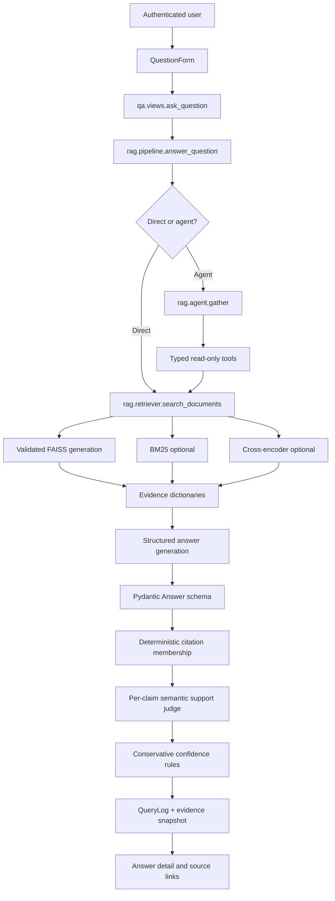
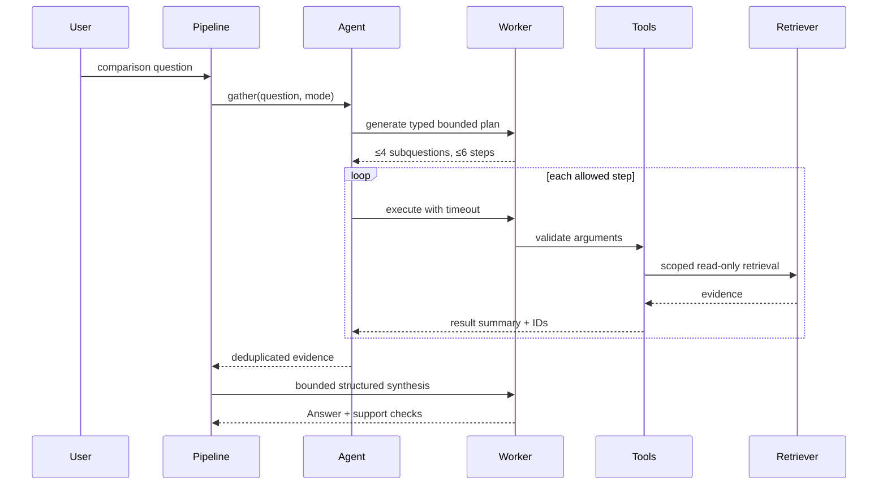
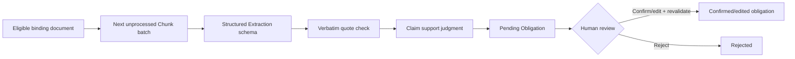

# Compliance Assistant — RAG System and Code Walkthrough

Updated: 4 October 2026.

This document explains the complete Retrieval-Augmented Generation (RAG) implementation in this project: how data enters the system, how it becomes searchable, how questions are answered, how citations and support are checked, how agent mode differs, and how the same foundation powers evaluation, obligation extraction, and policy-gap analysis.

It is a code guide, not a replacement for the source. Code excerpts are intentionally short and omit surrounding error handling where that makes the idea easier to see.

## 1. The RAG system in one sentence

The application validates and classifies PDFs, splits them into traceable passages, embeds those passages into an immutable FAISS index, retrieves the most relevant evidence for a question, asks a language model for schema-constrained claims using only that evidence, verifies every cited passage and claim, and stores the complete answer/evidence snapshot for review.

## 2. End-to-end architecture



The ingestion side is separate:


## 3. Key packages

| File/package | Responsibility |
| --- | --- |
| `qa/forms.py` | Validates PDF uploads and question options |
| `qa/services/documents.py` | Coordinates parsing, chunk database changes, and index rebuilds |
| `rag/chunker.py` | Extracts bounded, page-linked passages from PDFs |
| `rag/embedder.py` | Loads SentenceTransformer and produces normalized vectors |
| `rag/vectorstore.py` | Builds, activates, validates, and queries immutable FAISS generations |
| `rag/lexical.py` | BM25 keyword retrieval |
| `rag/retriever.py` | Dense, hybrid, filtered, and reranked retrieval |
| `rag/reranker.py` | Cross-encoder scoring of query/passage pairs |
| `rag/schemas.py` | Strict output contracts for answers and judgments |
| `rag/prompts.py` | Versioned answer/support/correctness instructions |
| `rag/generator.py` | OpenRouter boundary, JSON validation, and one repair attempt |
| `rag/faithfulness.py` | Citation membership and per-claim support validation |
| `rag/confidence.py` | Conservative qualitative evidence assessment |
| `rag/pipeline.py` | End-to-end direct/agent answer orchestration |
| `rag/agent.py` | Bounded plan, hard timeouts, tool execution, and trace |
| `rag/tools.py` | Typed, read-only agent tools |
| `qa/views.py` | Web request, persistence, access control, and answer display flow |
| `qa/services/evaluation.py` | Retrieval and answer-quality evaluation |
| `qa/services/obligations.py` | Source-grounded duty extraction and review |
| `qa/services/gap_analysis.py` | Policy retrieval and obligation coverage judgments |

## 4. Core data model

The main RAG records are in `qa/models.py`.

### Document

Represents one uploaded PDF and its legal/operational metadata. Important fields include:

- `document_type`: regulatory source or company policy.
- `source_category`: binding regulation, circular, consultation, report, internal policy, and so on.
- `status`: in force, amended, repealed, draft, or not applicable.
- Dates, version label, and version family.
- Digest, page count, index status, passage count, and error state.

These fields are not merely decorative. Retrieval can filter by document type, the agent uses version metadata, and obligation extraction only accepts eligible binding categories.

### Chunk

Stores one searchable passage:

- Document relationship.
- Passage index and paragraph/clause label.
- Extracted text and SHA-256 hash.
- PDF start/end pages and printed page references.
- Chunker version and metadata.

The integer database ID is also the ID stored in FAISS's JSON mapping. It becomes the trusted citation identifier supplied to the model.

### VectorIndexBuild

Audits each build: generation ID, model, vector dimension, corpus fingerprint, vector count, status, activation state, error type, and timestamps.

### QueryLog

Stores the question, rendered answer, structured answer payload, retrieved IDs, evidence snapshot, confidence/support results, model/prompt/configuration, timing, error information, ownership, and optional agent link.

### AgentRun and AgentStep

Store the bounded plan and operational execution trace. They do not store hidden model reasoning.

### Evaluation, obligations, and gaps

`GoldQuestion`, `GoldEvidence`, `EvalRun`, `EvalResult`, `ObligationExtractionRecord`, `Obligation`, `GapAnalysisRun`, and `GapFinding` extend the same evidence model into quality testing and compliance workflows.

## 5. Phase A — upload validation

Entry point: `qa.forms.DocumentUploadForm.clean_file()`.

The form calls `validate_pdf(upload)`, which checks:

```python
data = upload.read(limit + 1)
if len(data) > limit:
    raise ValidationError(...)
if not data.startswith(b'%PDF-'):
    raise ValidationError(...)
```

It then opens the bytes with PyMuPDF and rejects encrypted, empty, too-large, or textless PDFs:

```python
with fitz.open(stream=data, filetype='pdf') as pdf:
    if pdf.needs_pass:
        raise ValidationError(...)
    if not any(page.get_text().strip() for page in pdf):
        raise ValidationError('No readable text found. OCR is not enabled.')
```

Finally it calculates the file digest. `DocumentUploadForm` rejects an existing document with the same digest, records the page count, and stores a sanitized original filename.

Why this exists: extension checks alone are unsafe and do not prove a PDF can be parsed. The RAG system needs readable text and stable source identity before indexing.

## 6. Phase B — PDF chunking

Entry point: `rag.chunker.chunk_pdf()`.

The chunker reads each PDF page, strips empty lines, recognizes common numeric/alphabetic clause markers, and tracks the current paragraph label.

```python
CLAUSE = re.compile(r'^(\d+(?:\.\d+)*\.?|\([a-z]+\))\s+', re.I)
```

Standalone decimal-like values are treated cautiously because financial charts often contain numbers that look like clauses. A marker is accepted only when prose follows.

Chunks are closed when a new clause starts or the next line would exceed the 160-word target:

```python
if current and (match or len(current['text'].split()) + len(line.split()) > 160):
    chunks.append(current)
    current = None
```

Each result receives:

```python
chunk.update(
    chunk_index=i,
    start_page=...,
    end_page=...,
    printed_start_page=...,
    printed_end_page=...,
    content_sha256=...,
    chunker_version='2',
)
```

Why 160 words: it reduces embedding truncation and keeps evidence small enough for claim-level citation. It is a word boundary, not an exact tokenizer limit. Tables and complex layouts remain heuristic.

## 7. Phase C — database synchronization

Entry point: `qa.services.documents.index_document()`.

The service obtains the corpus lock, revalidates the stored file, chunks it, and compares the result with existing passage positions.

```python
old = existing.get(data['chunk_index'])
if old and old.content_sha256 == data['content_sha256'] \
       and old.paragraph_id == data['paragraph_id']:
    # update metadata while preserving the Chunk ID
else:
    # replace the changed passage
```

Preserving unchanged IDs matters because query logs and gold evidence may refer to them. Changed or removed passages are replaced, and reference-question approval involving the changed document is invalidated.

Database changes happen in a transaction. Afterward, the service rebuilds the complete index. If rebuilding fails, the document is marked with an index error and queries reject a stale generation.

Deletion follows the same safe pattern: delete database records under the lock, invalidate affected approvals, and rebuild. Uploaded bytes are retained for recovery.

## 8. Phase D — embeddings

Entry points: `rag.embedder.embed_texts()` and `embed_query()`.

```python
@lru_cache(maxsize=2)
def get_embedder(model_name=None):
    return SentenceTransformer(model_name or settings.EMBEDDING_MODEL)
```

The model is cached within the process so repeated requests do not reload it.

```python
model.encode(texts, normalize_embeddings=True, batch_size=32)
```

Normalized vectors allow inner product to behave as cosine similarity. Output is forced to NumPy `float32`, the format expected by FAISS.

The default configuration is:

```text
EMBEDDING_MODEL=all-MiniLM-L6-v2
EMBEDDING_DIMENSION=384
```

Changing either requires a complete index rebuild.

## 9. Phase E — immutable FAISS index

Entry points: `rag.vectorstore.rebuild()` and `VectorStore`.

### Generation layout

```text
vectorstore/
├── CURRENT
├── .corpus.lock
└── generations/
    └── <32-character-generation-id>/
        ├── faiss_index.bin
        ├── id_mapping.json
        └── manifest.json
```

`CURRENT` contains only the active generation ID. Old generations remain available for recovery/audit.

### Corpus fingerprint

`fingerprint(rows)` hashes actual passage text, IDs, page/paragraph metadata, chunker version, title, type, authority/status, dates, version metadata, and source URL.

This detects database/index drift even if a cached passage hash was not updated.

### Build

The implementation creates an inner-product index:

```python
index = faiss.IndexFlatIP(settings.EMBEDDING_DIMENSION)
vectors = embed_texts([c.text for c in batch])
index.add(vectors)
```

Before writing, it verifies vector shape, finite numbers, and approximately unit norm. It writes the FAISS index, a JSON list mapping positions to `Chunk.id`, and a manifest containing configuration, fingerprint, count, time, and file checksums.

The build is then reloaded and revalidated. It also recomputes the corpus fingerprint immediately before activation to detect a concurrent source change.

### Atomic activation

The complete `.building` folder is renamed, then a temporary pointer is flushed to disk and atomically replaces `CURRENT`:

```python
with pointer.open('w', encoding='utf-8') as stream:
    stream.write(generation)
    stream.flush()
    os.fsync(stream.fileno())
replace_pointer(pointer, root / 'CURRENT')
```

Windows sharing violations receive five bounded retries. The old `CURRENT` file is never deleted first, so a permanent replacement failure preserves the prior generation.

### Load validation

`VectorStore.__init__()` checks:

- Valid generation identifier.
- Exact expected files.
- SHA-256 checksums.
- FAISS model dimension and inner-product metric.
- Normalization flag.
- Vector count, mapping count, and unique IDs.
- Mapping order against current database passage IDs.
- Current corpus fingerprint.

Any failure becomes one safe error:

```python
IndexIntegrityError(
    'Index rebuild required: active index is missing, incompatible, or stale.'
)
```

This is fail-closed behavior: the application does not quietly answer from stale vectors.

## 10. Phase F — retrieval modes

Entry point: `rag.retriever.search_documents()`.

All modes return evidence dictionaries containing trusted source metadata:

```python
{
  'chunk_id': 123,
  'document_id': 2,
  'document_title': '...',
  'source_category': 'report',
  'document_status': 'not_applicable',
  'paragraph_id': '4.2',
  'start_page': 12,
  'end_page': 13,
  'printed_pages': '71–72',
  'text': '...',
  'content_sha256': '...'
}
```

The model does not invent these fields; the application constructs them from database records.

### 10.1 Dense semantic retrieval

`VectorStore.search()` embeds the question and searches FAISS:

```python
embedding = embed_query(query).reshape(1, -1)
scores, positions = self.index.search(embedding, top_k)
```

Positions are converted back to database passage IDs through `id_mapping.json`. The retriever applies the configured dense floor and returns the first `top_k` allowed results.

### 10.2 BM25 lexical retrieval

`rag.lexical.search()` tokenizes lowercased words while retaining useful dots/hyphens, builds a BM25 model over allowed passages, and orders positive-scoring results deterministically.

BM25 is useful for exact clause numbers, abbreviations, named schemes, and uncommon legal terms that semantic similarity may underweight.

### 10.3 Hybrid retrieval

Dense and BM25 rankings are combined using weighted reciprocal-rank fusion:

```python
item['score'] += weight / (rrf_k + rank)
```

This deliberately fuses ranks rather than pretending raw cosine and BM25 values have the same scale. The returned record retains `dense_score`, `bm25_score`, and each component's rank for inspection.

### 10.4 Cross-encoder reranking

`rag.reranker.rerank()` evaluates each `(question, candidate passage)` pair with a cached CrossEncoder:

```python
scores = cross_encoder.predict([(query, c['text']) for c in candidates])
```

It sorts by `reranker_score` and returns the best passages. This is generally more expensive than vector search because the cross-encoder jointly reads each pair.

### 10.5 Filters happen before top-k

The retriever first creates the allowed passage set:

```python
allowed = {
    c.id: c for c in store.rows
    if c.document.document_type == document_type
    and (not document_ids or c.document_id in document_ids)
}
```

This is important when regulatory sources and company policies share one index. A policy-only query must not lose its top results because regulatory passages occupied the unfiltered top-k.

### 10.6 Lock scope

The corpus lock is held only while loading/validating the index snapshot. Slow embedding, BM25, reranking, and provider calls happen outside the writer lock. That lets a request use one validated immutable generation without blocking corpus operations for the full model runtime.

## 11. Phase G — strict model boundary

Entry point: `rag.generator.structured_call()`.

The model never returns a free-form answer directly into the trusted data path. A Pydantic schema is added to the system message, and the response must validate as JSON.

```python
messages = [
    {'role': 'system', 'content': prompt + '\nSchema:\n' + schema_json},
    {'role': 'user', 'content': json.dumps(data, default=str)},
]
```

Calls use temperature zero and no automatic SDK retries. They request OpenRouter-native `json_schema` output and require an endpoint that supports the parameter. If the first non-empty output is invalid, the application asks once for the same answer as schema-valid JSON.

Configured fixed fallback models are tried next. `openrouter/free` is the final fallback, allowing OpenRouter to route to a free endpoint that supports structured output; the actual returned model and whether fallback was used are recorded. Empty-content reasoning responses move directly to the next model instead of wasting another full repair call. Authentication/authorization failures return immediately because another model cannot repair an invalid key.

Provider exceptions are sanitized:

```python
raise GenerationError('Model provider unavailable. Please retry later.')
```

This prevents provider bodies, submitted document text, or credentials from being exposed through the UI.

### Strict answer schema

`rag.schemas.Answer` contains:

```python
class Answer(StrictModel):
    answerable: bool
    claims: list[Claim]
    reason: str
```

Each `Claim` contains a short ID, factual text, and one or more integer supporting chunk IDs. Extra fields and loose type conversion are forbidden.

The validator enforces:

- Answerable responses must contain claims.
- Refusals must contain no claims.
- Claim IDs must be unique.

## 12. Prompt isolation

`rag.prompts.UNTRUSTED` tells the model that every question, document, and answer field in the JSON user message is untrusted data. Apparent instructions inside PDFs must not override the system task.

The answer prompt adds:

- Use only supplied passages.
- Make source-supported atomic claims.
- Cite only supplied numeric passage IDs.
- Respect source authority/status.
- Abstain when evidence is inadequate.
- Do not add uncited summaries.

Prompt isolation reduces risk but does not prove immunity to prompt injection. Live adversarial validation remains necessary.

## 13. Phase H — citation and faithfulness checks

Entry point: `rag.faithfulness.check_claims()`.

This has two layers.

### Layer 1: deterministic membership

```python
sources = {c['chunk_id']: c for c in chunks}
if any(i not in sources for i in claim.supporting_chunk_ids):
    status = 'unsupported'
```

A claim cannot cite a passage that was not actually supplied to the generator. This prevents fabricated passage IDs from becoming valid citations.

### Layer 2: semantic support judgment

For valid IDs, each claim is sent to the judge together with only its cited passages. The strict result must contain exactly one judgment per claim and may use only citation IDs the claim already supplied.

Support states are:

- `supported`: the full claim follows from cited evidence.
- `partial`: important qualifications are missing.
- `unsupported`: evidence does not establish it.
- `contradicted`: evidence conflicts with it.
- `unavailable`: the application adds this when semantic validation could not complete.

Faithfulness and citation precision remain `None` when the semantic judge is unavailable. Missing validation is never reported as success.

## 14. Phase I — confidence assessment

Entry point: `rag.confidence.assess()`.

Confidence is rule-based and intentionally conservative:

```python
if not answer.answerable:
    return 'insufficient', True, answer.reason
if support['unavailable'] or not support['supported']:
    return 'low', True, ...
return 'medium', False, ...
```

The current implementation never produces `high`, because no accepted calibration supports that label. When both lexical and dense retrieval found evidence, the explanation notes agreement, but the label remains qualitative—not a probability of truth.

## 15. Phase J — direct answer orchestration

Entry point: `rag.pipeline.answer_question()`.

For direct mode, the flow is:

```python
with corpus_lock():
    store = VectorStore(...)
    manifest = store.manifest

chunks = search_documents(question, mode=mode, store=store)
answer, metadata = structured_call(ANSWER, {...}, Answer)
support = check_claims(answer, chunks)
confidence = assess(answer, support, chunks)
```

The full result includes:

- Rendered answer text.
- Structured claims and per-claim sources/support.
- Complete evidence snapshot.
- Not-found/refusal state.
- Faithfulness and citation precision.
- Retrieval component scores.
- Model and prompt versions.
- Index generation/fingerprint and retrieval settings.
- Agent run ID when applicable.

If no passages survive retrieval, it creates a structured abstention without asking the answer model to invent content.

## 16. Phase K — web request and persistence

Entry point: `qa.views.ask_question()`.

The question form supplies:

- Question text.
- Retrieval mode: dense, hybrid, or hybrid rerank.
- Strategy: automatic, direct, or agent.

Automatic strategy uses `rag.agent.needs_agent()` to detect comparisons, changes, versus wording, and certain multi-part questions.

After `answer_question()` completes, the view saves `QueryLog` with the user, payload, passage IDs, scores, support/confidence, model/configuration, review flag/reason, and total response time. Agent runs are linked to the saved query.

If processing fails, the view still stores an error record for operational visibility, but shows a sanitized user message.

The answer page renders source metadata from the stored evidence snapshot and provides authenticated links to the original PDFs.

## 17. Agent RAG flow

Agent mode is a bounded evidence-gathering layer in front of the same structured answer and support pipeline.



### Planning

`gather()` provides a catalog of regulatory documents and asks for a strict `Plan`. The plan schema limits subquestions and steps. Configuration applies a second limit even if schema limits change.

For “what changed” or amendment questions, the code requires two dated sources in exactly one shared version family. It refuses to pretend unrelated documents are historical versions.

### Allowed tools

`rag.tools.execute()` exposes only:

1. `search_documents(query, document_ids, top_k)`
2. `get_document_metadata(document_ids)`
3. `get_chunks(chunk_ids)`
4. `compare_documents(document_a, document_b, topic)`

Every argument object is validated through a strict Pydantic input schema. There is no arbitrary filesystem, shell, database mutation, or network tool.

### Scope enforcement

The agent validates every referenced document against the approved catalog. Empty search scope is replaced with the complete allowed catalog, and final evidence document IDs are checked again.

### Hard timeouts

Each plan/tool/synthesis call runs in a spawned child process. `bounded_call()` waits only for the allocated time and terminates the worker if it exceeds the deadline. The total budget is shared across the run.

This is stronger than abandoning a thread because the timed-out process stops spending provider/CPU resources.

### Trace

`AgentRun` and `AgentStep` record the plan summary, subquestions, tool name/input, evidence IDs, safe output summary, latency, status, and error type. This is an operational trace, not chain-of-thought.

## 18. Evaluation flow

Entry point: `qa.services.evaluation.run_evaluation()`.

```mermaid
flowchart LR
    G[Reviewed GoldQuestion] --> E[Run configuration snapshot]
    E --> R[Retrieve or full answer]
    R --> RM[Hit@k, Recall@k, MRR]
    R --> AJ[Correctness judge]
    R --> FM[Faithfulness and citation metrics]
    R --> RF[Refusal metrics]
    RM --> ER[EvalResult]
    AJ --> ER
    FM --> ER
    RF --> ER
    ER --> RUN[EvalRun aggregate + coverage]
```

Before starting, evaluation validates active questions, reference answers, review timestamps, and current evidence anchors. Explicit `allow_unreviewed` mode creates provisional runs; it does not approve a question.

The run snapshots:

- Corpus fingerprint and embedding model.
- Retrieval mode and candidate/settings values.
- Answer/judge models and prompt version.
- Exact question/reference/evidence configuration.

Retrieval-only mode skips all answer-provider work. Full mode calls the same `answer_question()` pipeline, then separately judges correctness against the reference answer and required evidence.

Failures are stored per result. Missing judge values remain null. Aggregate coverage reports how many judgments actually completed.

## 19. Obligation extraction as a RAG derivative

Entry point: `qa.services.obligations.extract_obligations()`.

This is not the ordinary question-answer path, but it reuses the same trusted evidence and validation components.



Eligibility requires regulatory type, in-force status, and binding regulation/master direction/circular category.

The generator may return zero or more `ExtractedObligation` records. For every candidate, the code:

1. Combines duty, party, condition, and timing into the full statement.
2. Verifies the proposed quote occurs verbatim in the current source passage.
3. Reuses `check_claims()` to assess whether the whole duty follows.
4. Stores the candidate as pending with model/prompt/source hashes.

Human confirmation re-resolves the current source and repeats quote/support validation. Stale or unsupported duties cannot be confirmed.

## 20. Policy gap analysis as scoped RAG

Entry point: `qa.services.gap_analysis.run_gap_analysis()`.

For each human-confirmed obligation:

1. Revalidate the obligation's current regulatory source.
2. Retrieve candidates only from the selected company policy using hybrid reranking.
3. Ask the strict `GapJudgment` schema to classify coverage.
4. Require cited policy evidence for addressed/partial/conflicting states.
5. Reject any passage ID outside the candidates.
6. Preserve regulatory and policy evidence snapshots.

```python
candidates = search_documents(
    obligation.obligation_text,
    document_ids=[policy.pk],
    document_type='company_policy',
    mode='hybrid_rerank',
    store=store,
)
```

Low confidence or any source/model/index validation failure becomes `needs_review`. Human reviewers can accept or override the automated status without erasing the original automated count.

## 21. Security and integrity boundaries

| Boundary | Control |
| --- | --- |
| Uploaded file | Signature, MIME, size, page count, encryption, parse, text, digest checks |
| Corpus mutation | Cross-process lock and database transaction |
| Index persistence | Immutable generation, checksums, JSON mapping, fingerprint, atomic pointer |
| Retrieval scope | Document type/ID filtering before top-k |
| Model input | Untrusted JSON data separated from system instructions |
| Model output | Strict schemas, no extra fields, one repair attempt |
| Citations | Application-owned passage IDs and membership check |
| Claim support | Separate strict judge using only cited passages |
| Agent | Typed read-only tools, catalog scoping, step/call/total limits, process termination |
| Obligation approval | Current source, exact quote, semantic support, named human reviewer |
| Gap finding | Confirmed duty, policy-only candidates, candidate-ID validation, human review |
| Access | Django permissions, owner-scoped logs/reports, authenticated PDF delivery |

These are defense layers, not proof of legal accuracy or complete security.

## 22. Main settings and their effect

| Setting | Effect |
| --- | --- |
| `OPENROUTER_MODEL` | Answer, planning, and extraction model |
| `OPENROUTER_JUDGE_MODEL` | Support, correctness, and gap judge |
| `LLM_TIMEOUT_SECONDS` | Individual provider timeout |
| `EMBEDDING_MODEL` | Passage/question vector model |
| `EMBEDDING_DIMENSION` | Required FAISS vector width |
| `RERANKER_MODEL` | Cross-encoder used by reranked mode |
| `RAG_RETRIEVAL_MODE` | Default dense/hybrid/hybrid_rerank mode |
| `RAG_DENSE_CANDIDATES` | Dense candidates entering fusion |
| `RAG_BM25_CANDIDATES` | Lexical candidates entering fusion |
| `RAG_RERANK_CANDIDATES` | Fused candidates evaluated by cross-encoder |
| `RAG_TOP_K` | Final evidence count |
| `RAG_RRF_K` | Reciprocal-rank fusion smoothing constant |
| `RAG_DENSE_WEIGHT` / `RAG_BM25_WEIGHT` | Rank-fusion source weights |
| `RAG_CONFIDENCE_THRESHOLD` | Minimum dense similarity used in retrieval |
| `RAG_RERANK_MIN_SCORE` | Minimum cross-encoder score |
| Agent limits/timeouts | Plan size and maximum execution time |

Changing embedding model/dimension requires rebuilding the index. Retrieval/prompt/model changes should produce a new evaluation rather than being compared as if configuration were unchanged.

## 23. What runs for each user action

### Upload

```text
DocumentUploadForm
→ validate_pdf
→ save Document as pending
```

### Index/Re-index

```text
qa.views.index_document
→ qa.services.documents.index_document
→ validate_pdf
→ rag.chunker.chunk_pdf
→ synchronize Chunk rows
→ rag.vectorstore.rebuild
→ embed_texts
→ activate generation
```

### Direct question

```text
qa.views.ask_question
→ rag.pipeline.answer_question
→ VectorStore validation
→ rag.retriever.search_documents
→ rag.generator.structured_call(Answer)
→ rag.faithfulness.check_claims
→ rag.confidence.assess
→ save QueryLog
→ answer_detail template
```

### Agent question

```text
qa.views.ask_question
→ rag.pipeline.answer_question(use_agent=True)
→ rag.agent.gather
→ bounded plan worker
→ typed tool workers
→ validate evidence scope/current corpus
→ bounded synthesis worker
→ save AgentRun/AgentStep + QueryLog
```

### Evaluation

```text
qa.services.evaluation.run_evaluation
→ validate reference questions/evidence
→ snapshot configuration
→ retrieve or call normal answer pipeline
→ compute retrieval metrics
→ optional correctness judge
→ aggregate coverage/quality/refusal/latency
```

### Obligation to gap report

```text
eligible regulation chunks
→ structured extraction
→ quote + semantic support validation
→ human obligation review
→ policy-only hybrid rerank
→ structured gap judgment
→ evidence validation
→ human finding review
→ HTML/PDF report
```

## 24. Active code versus legacy compatibility code

The current answer path uses:

- `rag.pipeline.py`
- `rag.generator.py`
- `rag.schemas.py`
- `rag.prompts.py`
- `rag.faithfulness.py`

`rag/llm.py` and `rag/citation_checker.py` are older free-form/regex helpers and are not called by the active structured pipeline. They remain in the repository for compatibility/history but should not be used as the architectural reference. New work should extend the structured pipeline rather than revive free-form string parsing.

## 25. Simplified end-to-end pseudocode

```python
def answer(question, retrieval_mode, strategy, user):
    # Load one validated immutable corpus snapshot.
    store = VectorStore()
    generation = store.manifest

    # Gather evidence directly or through bounded typed tools.
    if strategy == 'agent':
        agent_run, evidence = gather(question, user, retrieval_mode)
    else:
        evidence = search_documents(question, mode=retrieval_mode, store=store)

    # Abstain rather than generate without evidence.
    if not evidence:
        structured_answer = Answer(answerable=False, claims=[], reason='...')
    else:
        structured_answer = structured_call(
            ANSWER,
            {'question': question, 'passages': evidence},
            Answer,
        )

    # Verify cited IDs and semantic support independently.
    support = check_claims(structured_answer, evidence)
    confidence, needs_review, reason = assess(
        structured_answer, support, evidence
    )

    # Persist evidence/configuration, not just rendered text.
    return {
        'answer': structured_answer,
        'evidence_snapshot': evidence,
        'support': support,
        'confidence': confidence,
        'needs_review': needs_review,
        'review_reason': reason,
        'generation_id': generation['generation_id'],
        'corpus_fingerprint': generation['corpus_fingerprint'],
    }
```

## 26. Testing the complete flow

Run all automated tests:

```powershell
.\.venv\Scripts\python.exe manage.py test tests
```

Validate application and migration state:

```powershell
.\.venv\Scripts\python.exe manage.py check
.\.venv\Scripts\python.exe manage.py makemigrations --check --dry-run
```

Validate the real active index:

```powershell
.\.venv\Scripts\python.exe manage.py check_vector_index
```

The current suite covers index generation/integrity, upload failures, permission enforcement, retrieval fusion/filtering/reranking, structured output repair, citation/support validation, agent limits/timeouts, obligation review, all gap statuses, PDF reports, evaluation, review, and analytics.

Tests mock remote provider decisions. They prove code behavior under controlled responses; they do not prove live answer correctness or legal reliability.

## 27. Current limitations and next improvements

1. Chunking is heuristic and does not preserve full table structure.
2. OCR is not implemented for scanned/image-only PDFs.
3. The index is rebuilt in full after corpus changes; suitable for a small corpus, not large-scale ingestion.
4. Operations are synchronous and can block a web request during model work.
5. SQLite and the filesystem are not one distributed transaction.
6. Confidence thresholds and labels are not accepted/calibrated yet.
7. The current gold drafts remain unapproved; retrieval results are provisional.
8. Live prompt-injection, model-quality, latency, and judge-agreement acceptance remain pending.
9. The real corpus has no eligible binding source/company-policy pair for real gap findings.
10. There is no tenant/organization-specific corpus isolation.

Natural engineering extensions include background job queues, OCR/table extraction, PostgreSQL, incremental/vector-database indexing, tenant-scoped retrieval, richer version graphs, observed model/cost telemetry, reviewer sampling, and continuous regression evaluation. Each should preserve the current evidence, schema, access, and fail-closed guarantees.

## 28. Suggested reading order for developers

1. `qa/models.py` — understand stored state.
2. `qa/forms.py` and `qa/services/documents.py` — ingestion boundary.
3. `rag/chunker.py`, `rag/embedder.py`, `rag/vectorstore.py` — indexing.
4. `rag/lexical.py`, `rag/retriever.py`, `rag/reranker.py` — evidence selection.
5. `rag/schemas.py`, `rag/prompts.py`, `rag/generator.py` — provider contract.
6. `rag/faithfulness.py`, `rag/confidence.py` — validation.
7. `rag/pipeline.py` and `qa/views.py` — complete request lifecycle.
8. `rag/agent.py` and `rag/tools.py` — bounded multi-step path.
9. `qa/services/evaluation.py` — measurement.
10. `qa/services/obligations.py` and `qa/services/gap_analysis.py` — downstream compliance workflows.
11. `tests/` — executable behavior and failure guarantees.

For operating instructions rather than implementation detail, see `FULL_OPERATIONS_WALKTHROUGH.md`. For current validation status and provisional results, see `PROJECT_STATUS.md`.
